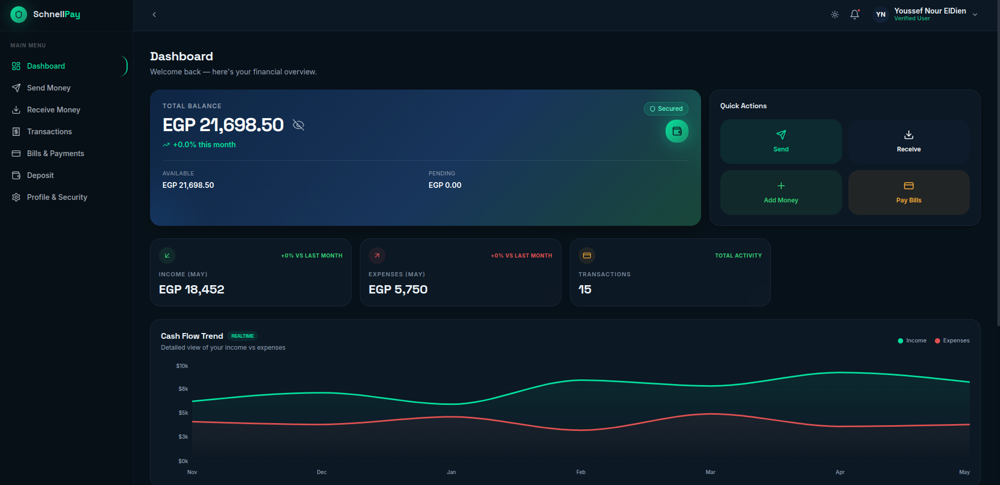
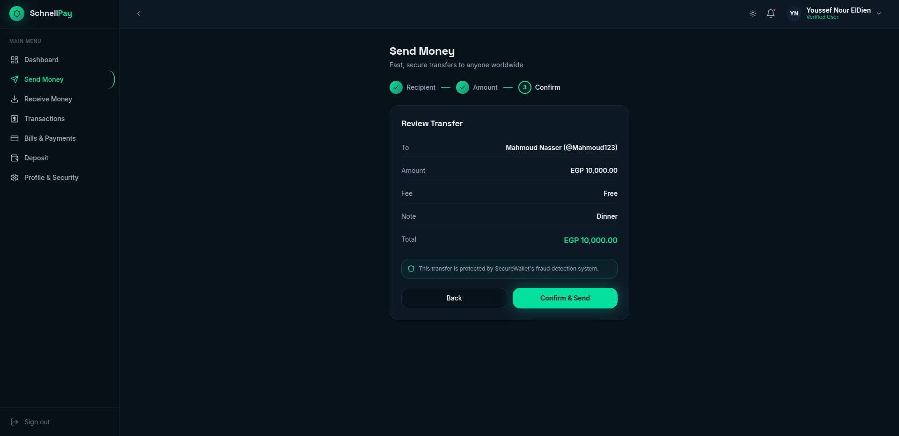

# Schnell-Pay Frontend

The frontend application for the Schnell-Pay digital wallet project. This interface allows users to seamlessly manage their digital wallets, process transactions, and view their balance, featuring a responsive UI and seamless transaction flows.

## Features
- Interactive and responsive dashboard for wallet management
- Secure transaction flow with 6-digit PIN verification
- Real-time balance and transaction history updates
- Modern UI built with React and Tailwind CSS

## Technologies Used
- React
- Vite
- Tailwind CSS
- framer-motion
- Zustand

## Screenshots

### Home Page


### Dashboard


### Send Money


## Installation & Setup

1. **Clone the repository:**
   ```bash
   git clone https://github.com/Mahmoud-Nasser1/SchnellPayy
   ```

2. **Navigate to the project directory:**
   ```bash
   cd Frontend
   ```

3. **Install dependencies:**
   ```bash
   npm install
   ```

4. **Run the development server:**
   ```bash
   npm run dev
   ```

## Related Repositories

Explore the other components of the Schnell-Pay platform:
- [Backend Repository](https://github.com/Yousef-Alaa/SchnellPay-BackEnd) - Node.js APIs and MS SQL server configuration.
- [ATM Repository](https://github.com/Yousef-Alaa/SchnellPay-ATM) - Embedded ATmega32 project and simulation for the physical ATM interface.
